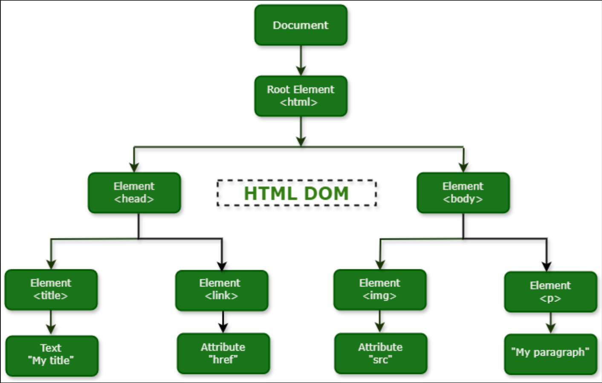

# HTML CSS and JS DOM Manipulation Basics

This repo shows some exaples of how to select and manipulate HTML DOM elements and how to add event listeners and handlers to elements. THere are also some full webpage examples.

## DOM Manipulation Overview

The DOM is a programming interface for web documents. It represents the structure of a document as a tree of objects, where each object corresponds to a part of the document, such as elements, attributes, and text. JavaScript can manipulate the DOM, allowing developers to change the content, structure, and style of a webpage in real time.

Below is a picture of the DOM tree structure:



## Key DOM manipulation features

- Element Selection --> DOM elements can be selected by id, class name, tag name, and via css selectors
- Element Modification --> Javascript can be used to modify element text content within an element, setting HTML attributes, modify classes and css styling, and add/remove css classes

- Element Creation and Removal --> HTML elements can be added and removed from the DOM using Javascript

- Event Handling --> Event listeners such as click, hover, keypress, scroll can be attached to html elements allowing users to interact with the webpage

## Selecting DOM elements

HTML DOM elements can be selected from the browser in a couple of different ways:

- getElementById --> used to access an element with a specific ID → let elementById = document.getElementById("byIdResult");

- getElementsByClassName --> returns a collection of elements with a specific class name → let elementsByClassName = document.getElementsByClassName("byClassNameResult");

- getElementsByTagName --> returns a collection of elements with a specific tag name → let elementsByTagName = document.getElementsByTagName("div");

- querySelector --> returns the first element that matches a specific CSS selector → let element = document.querySelector(".myClass");

- querySelectorAll --> returns all elements that match a specific CSS selector and returns them in an array → let elements = document.querySelectorAll(".myClass");

HTML, CSS, and JS code examples can be found selecting-dom-elements folder. You can also view the examples in the browser by openning up the index.html file in your browser of choice.

## Manipulating DOM elements

HTML DOM elements can be manipulated in the browser in a couple of different ways:

- Changing Content --> You can change the content of an element using innerHTML → element.innerHTML = "New Content";

- Changing Attributes --> element.setAttribute("attributeName", "attributeValue");

- Changing Styles --> element.style.color = "red";

- Adding and Removing Classes -->

  - Adding → element.classList.add("newClass");
  - Removing → element.classList.remove("oldClass");

- Creating New Elements --> let newElement = document.createElement("div");

- Appending and Removing Elements -->

  - Appending → parentElement.appendChild(newElement);
  - Removing → parentElement.removeChild(childElement);

- Event Handling --> element.addEventListener("click", function() { // Code to be executed when the element is clicked});

HTML, CSS, and JS code examples can be found manipulating-dom-elements folder. You can also view the examples in the browser by openning up the index.html file in your browser of choice.

## DOM Event Listeners/Handlers

- Click Event Handler

```js
// Get the element
let button = document.getElementById("myButton");

// Define the event handler function
function handleClick() {
  alert("Button Clicked!");
}

// Attach the event handler to the click event
button.addEventListener("click", handleClick);
```

- Mouseover and Mouseout Event Handlers

```js
// Get the element
let button = document.getElementById("myButton");

// Define the event handler function
function handleClick() {
  alert("Button Clicked!");
}

// Attach the event handler to the click event
button.addEventListener("click", handleClick);
```

- Form Submission Event Handler

```js
// Get the form element
let form = document.getElementById("myForm");

// Define the event handler function
function handleSubmit(event) {
  event.preventDefault(); // Prevents the form from actually submitting

  let input = document.getElementById("textInput");
  alert("Form Submitted with value: " + input.value);
}

// Attach the event handler to the form submission event
form.addEventListener("submit", handleSubmit);
```

HTML, CSS, and JS code examples can be found event-handlers folder. You can also view the examples in the browser by openning up the index.html file in your browser of choice.

## Full Webpage Examples

You will find two full webpage examples on how to use DOM manipulation in real projects in the website-examples folder. Each webpage example will contain two folders, a start and a complete. The complete folder contains all the neccessary code to make the webpage interractive, while the start examples includes everything except the Javascript code. Use the start folder as your playground to practive DOM manipulation and refer to the complete folder as your reference on how to manipulate the DOM

### Base Apparel webpage

#### Screenshot


This project is a landing page example for an apparel company. Javascript is used for validating the form input when a use clicks the submit button. The JS code validates that the input is not blank, that the email is valid(contains an '@' symbol and a '.com'), and displays an error if the validation fails.

### interactive Rating Component webpage

#### Screenshot


This project is a rating component example. Each time the user clicks on a rating, that rating is set to active and it's value is stored and then used on the next component when the user clicks the submit button. Take a look at the way the two components are displayed/removed from the UI based on updating their classes with Javascript.
